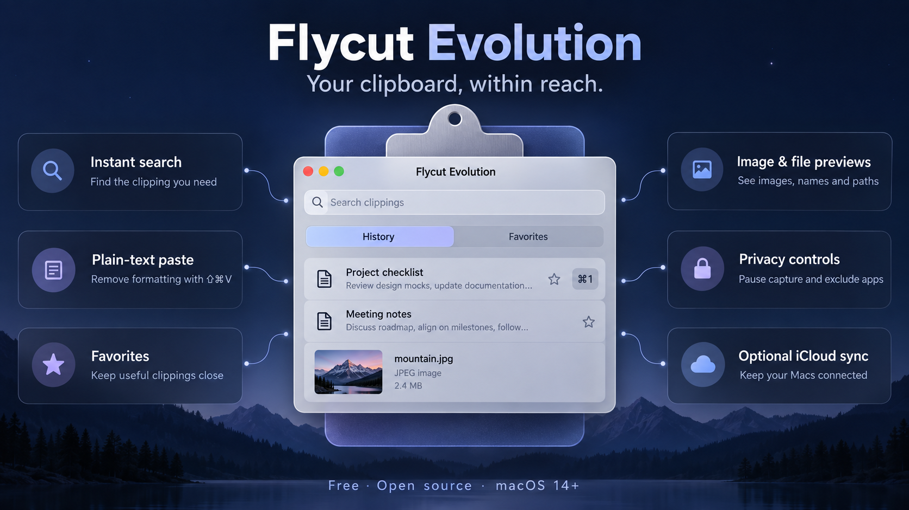

# Flycut Evolution



Flycut Evolution is a free, open source clipboard manager for Mac. It keeps copied text, images, and file references within reach, so you can search, preview, and paste them again from the menu bar. Emerging Dynamics maintains this Swift rewrite as a continuation of [TermiT/Flycut](https://github.com/TermiT/Flycut), which was based on [Jumpcut](http://jumpcut.sourceforge.net/). The app remains [MIT licensed](license.txt).

**Version 1.0.2** · **[Download the latest release](https://github.com/kabadabra/Flycut-Evolution/releases/latest)** · [What changed](CHANGELOG.md) · [Report an issue](https://github.com/kabadabra/Flycut-Evolution/issues)

## Features

- **Open history from anywhere.** Press **Option–Command–V** or click the menu bar icon. Search is ready immediately; click a result, press Return, or use **Command–1–9** to activate visible entries. Both global shortcuts are configurable.
- **Find the copy you remember.** Search across recent clippings and favorites with exact-first fuzzy matching, highlighted matches, and context from long text. Image text recognized on your Mac and saved file paths are searchable too.
- **Keep useful favorites.** Name snippets, edit their text, reorder them, and assign stable **Option–Command–1–9** shortcuts while history is open. Rename image and file favorites while retaining their original content. Conflicting shortcut assignments are flagged for you to resolve.
- **Paste with or without formatting.** Normal text paste retains saved RTF when available. **Shift–Command–V** immediately pastes the current clipboard as plain text, including in Microsoft Teams. Automatic paste requires Accessibility access; otherwise the entry is copied for manual paste.
- **See images and file details.** Capture screenshots and copied images, view thumbnails and previews, and paste the captured image. Finder image previews include selectable filenames and full paths. Other copied files show their names and paths and paste their original file references when available.
- **Extract image text locally.** Recognize text from images on your Mac for search, then copy the extracted text separately. Image capture is enabled on fresh installations and opt-in when upgrading an older text-only installation.
- **Control what gets captured.** Exclude selected applications, ignore the next copy, or pause capture for 5, 15, or 60 minutes. Password fields and sensitive clipboard types are filtered before their contents are read.
- **Keep history within your limits.** Repeated copies from the same source move one entry to the top. Recent and favorite limits stay fixed during capture, import, and sync. Lower limits apply immediately, with private recovery backups for saved history. Image storage has its own budget and protects image favorites from budget eviction.
- **Sync with your Macs when you choose.** Optional private iCloud sync shares text, favorites, formatting, and file-reference metadata. Images have a separate opt-in on each Mac. Device settings stay local; file-reference sync does not upload document contents.
- **Get signed updates and guided setup.** Check for Updates from Settings or the history menu. Automatic checks default off. Reopen setup whenever you want to review shortcuts, permissions, or the paste test.

Hover a clipping to inspect its full text, formatting, or image/file details. The palette closes on outside clicks, uses rounded shortcut badges, and places favorite stars beside those badges. Appearance settings control preview behavior, light/dark mode, menu bar icons, and palette size.

## Requirements and installation

Flycut Evolution requires **macOS 14 or later** on an **Apple Silicon or Intel Mac**. The release contains both architectures and has been tested on macOS 27. Cloud Sync requires iCloud and Macs signed into the same Apple Account.

1. Download **Flycut-Evolution.dmg** from the [latest release](https://github.com/kabadabra/Flycut-Evolution/releases/latest), open it, and drag **Flycut Evolution.app** to Applications. The release app and disk image are Developer ID signed and notarized by Apple.
2. Open the app and allow clipboard access if macOS asks. To paste automatically into other apps, grant Flycut Evolution Accessibility access in **System Settings → Privacy & Security → Accessibility**. Without it, clicking a clipping still copies it for manual paste.
3. To use Cloud Sync, turn it on in **Settings → Cloud Sync** after reviewing the upload notice, then enable it on your other Mac. Sync is optional; your history works locally without it.

The [Flycut 2.0 release](https://github.com/kabadabra/Flycut/releases/tag/v2.0.0) remains available for older Macs. If you are upgrading, follow the [migration steps](#moving-to-flycut-evolution) below before removing the old app.

## Everyday use

Copy text, images, or files as usual. Press **Option–Command–V** or click Flycut's menu bar icon to search your clippings; select one with a single click or the keyboard. Right-click a favorite and choose **Edit Favorite…** to change its name, text, or shortcut. Choose **Favorites** to reorder snippets. Press **Command–Return** to save an edit, or Escape to cancel. Use **Shift–Command–V** for an immediate plain-text paste of your current clipboard. Settings also provide pause, favorites, export, keyboard help, and controls for history and privacy. Formatted previews and pastes require RTF in the original copy; older, HTML-only, and unsupported copies remain plain text.

Exact search covers full clipping text. Fuzzy search examines the first 5,000 characters of each clipping. Assigned favorite shortcuts stay the same when favorites are reordered; conflicting assignments received through sync are marked **Conflict** and disabled until you choose different numbers.

## Build locally

Use Xcode 27.0 (Swift 6.4, Swift 6 language mode). Open `Package.swift` in Xcode or run:

```sh
swift test
scripts/build-app.sh debug
open 'build/Preview/Flycut Evolution Preview.app'
scripts/build-app.sh release
scripts/verify-app.sh 'build/Export/Flycut Evolution.app'
```

The preview has a separate `com.edynamics.flycut.preview` identity and data. Local bundles are ad hoc signed. The production bundle is `build/Export/Flycut Evolution.app`, identity `com.edynamics.flycut`, version `1.0.2`. Cloud Sync requires the production app to be signed with the Flycut CloudKit Developer ID profile. Opening it can start production migration; use the preview for routine development. See [developer notes](docs/DEVELOPING.md) and [release setup](RELEASE_SETUP.md).

## Moving to Flycut Evolution

1. Quit every Flycut instance. Keep the old app and saved preferences until you have checked the import. If history was never saved, export any clippings you need before quitting the old version.
2. Install the reviewed, signed `Flycut Evolution.app` from its DMG. Launch **/Applications/Flycut Evolution.app** explicitly by path so macOS does not choose the old `Flycut 2.0.app`.
3. If Flycut finds an older saved source, review the migration preview: choose the current fork, an earlier `com.kabadabra.flycut` source, original sandboxed Flycut, or a selected `.plist`. If no source is available, setup skips the importer. You can still open it later from Settings. If container access is denied, use the file picker. Choose one source; imports are not silently combined.
4. Check counts, unsupported settings, malformed entries, and the proposed destination. Existing destination data requires a merge or replace choice and a destination backup. The importer copies the source to a private backup and leaves the source untouched. Reimporting the same source is idempotent. Your configured recent and favorite limits remain fixed. Imports exceeding them create a private recovery backup before retaining the entries within those limits. A legacy “never save” setting keeps imported clips in memory unless you explicitly change the save mode.
5. Verify recent clips, favorites, settings, and paste behavior. Keep the backup for recovery. **Only then remove the old Flycut 2.0.app**: both versions use `com.edynamics.flycut` and should not remain installed together. Disable any old login registration and set Open at Login in the new app as needed. Recheck Accessibility permission for the new app.

The original upstream app uses a different identity, but running multiple clipboard managers during migration can confuse capture and paste behavior. Imported cloud flags never enable sync.

## Development tools

QMD and Graphify are optional local navigation tools. See [developer notes](docs/DEVELOPING.md). Generated indexes and graphs are not release assets. The earlier Objective-C and iOS sources remain in the [historical Flycut repository](https://github.com/kabadabra/Flycut); this repository contains the active Swift product.

## Credits and license

Original Flycut by General Arcade, Gennadiy Potapov, and contributors. Jumpcut by Steve Cook and contributors. This fork keeps the **Flycut** name and the original MIT license. See [acknowledgements](acknowledgements.txt) for included libraries and their authors. To support the original maintainers, see [their project](https://github.com/TermiT/Flycut).

Flycut 2.0 includes work from recent upstream contributors. Thank you to [Emanuel Stadler (@emanuelst)](https://github.com/emanuelst) for the [macOS 27 menu bar fix](https://github.com/TermiT/Flycut/pull/328) and [bezel improvements](https://github.com/TermiT/Flycut/pull/327) adapted in [our PR #3](https://github.com/kabadabra/Flycut/pull/3); [Ilya Bersenev (@voidless)](https://github.com/voidless) for the [keyboard layout paste fix](https://github.com/TermiT/Flycut/pull/314); [Tyler Martin (@tymrtn)](https://github.com/tymrtn) for the [CloudKit startup fix](https://github.com/TermiT/Flycut/pull/322); and [@agentheath](https://github.com/agentheath) for the [macOS 26 menu bar crash fix](https://github.com/TermiT/Flycut/pull/323).

Bug reports, ideas, and pull requests are welcome. See [contributing](CONTRIBUTING.md) for how to report a problem without sharing private clipboard data.

### Capture privacy, images, and updates

Privacy settings let you exclude applications by bundle identity. The history menu also offers Ignore Next Copy and timed pauses. Exclusions use the application active when a clipboard change is observed; rapid app switches can affect attribution. Adding an exclusion leaves existing history intact.

Enable image capture in Images settings to retain copied images/screenshots, preview and paste images, and search their text after local recognition. Existing installations stay text-only until enabled. Fresh installations enable image capture and recognition. Use Preview Image or Copy Extracted Text from an image's context menu. Finder image copies retain the captured image, filename, and original full path. Hover an entry to preview the image and select its filename or path for separate copying. Clicking an image entry pastes its captured pixels. Other copied files retain file references and show names and paths; pasting them requires the originals to remain available. Screenshots and direct image copies may have no filename or path. Older filename-only entries must be copied again. Immediate Shift–Command–V continues to paste current text without formatting; it does not automatically recognize a freshly copied image.

Each image is limited to 16 MiB and 24 million pixels. The default image budget is 200 MiB; older recent images are removed when it fills and image favorites are protected. Image sync has its own opt-in on every Mac, alongside Cloud Sync. Update all synced Macs to 1.0.2 before relying on image, file, or favorite metadata. A file path received from another Mac may not exist locally; document contents are not included in file-reference sync.

Check for Updates is available from Settings and the history menu. Automatic checks default off, and you choose downloads/installations. Setup explains capture, shortcuts, permission status, and a guided paste test, and can be reopened at any time. Version 1.0.2 publishes a signed update feed alongside the notarized installer.
